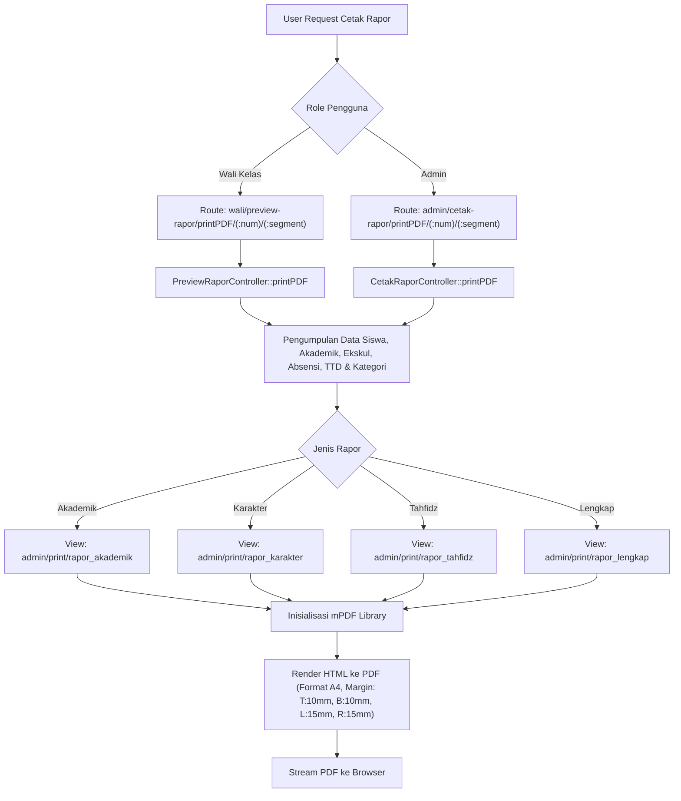

# Analisis Proses Cetak Rapor dan Solusi Halaman Tanda Tangan Terpisah

Dokumen ini berisi hasil analisis mengenai proses cetak rapor pada sistem E-Rapor Easy, khususnya pada halaman `/wali/preview-rapor` (Wali Kelas) dan `/admin/cetak-rapor` (Admin), serta solusi teknis untuk memastikan tabel nilai ekstrakurikuler, ketidakhadiran, dan seluruh tanda tangan tetap rapi dalam satu halaman (tidak terpisah secara yatim/piatu seperti pada tangkapan layar).

---

## 1. Analisis Alur Proses Cetak Rapor

Proses cetak rapor pada kedua halaman memiliki alur kerja yang serupa karena keduanya memanggil engine PDF dan template view yang sama:



### Detil Teknis Render:
1. **Controller**: `PreviewRaporController.php` (Wali Kelas) dan `CetakRaporController.php` (Admin).
2. **Library PDF**: Menggunakan **mPDF** (`\Mpdf\Mpdf`) dengan pengaturan ukuran kertas **A4** dan margin:
   - Atas (Margin Top): `10mm`
   - Bawah (Margin Bottom): `10mm`
   - Kiri (Margin Left): `15mm`
   - Kanan (Margin Right): `15mm`
3. **Template View**: Terletak di folder `backend/app/Views/admin/print/`.

---

## 2. Penyebab Masalah Tanda Tangan Terpisah (Root Cause)

Berdasarkan analisis file view (misalnya [rapor_lengkap.php](file:///d:/xampp/htdocs/erapoteasy/backend/app/Views/admin/print/rapor_lengkap.php) dan [rapor_akademik.php](file:///d:/xampp/htdocs/erapoteasy/backend/app/Views/admin/print/rapor_akademik.php)), berikut adalah penyebab utama tanda tangan Kepala Sekolah terpisah sendirian ke halaman berikutnya:

1. **Struktur Tabel TTD**:
   Tanda tangan diatur menggunakan satu tabel (`<table>` atau `.ttd-container`) yang memiliki dua baris (`<tr>`):
   - Baris 1: Tanda tangan Orang Tua/Wali (kiri), QR Code Validasi (tengah), dan Wali Kelas (kanan).
   - Baris 2: Tanda tangan Kepala Sekolah (tengah, bawah).
2. **Perilaku Default mPDF**:
   Secara default, mPDF akan memotong baris tabel (`page-break`) apabila tinggi halaman kertas A4 tidak cukup untuk merender keseluruhan baris tabel tersebut. Karena baris 1 dan baris 2 memiliki konten gambar (TTD digital) yang cukup tinggi, total tinggi tabel tanda tangan bisa berkisar antara **130px - 150px**.
3. **Ketiadaan Aturan Mencegah Pemotongan**:
   Tabel tanda tangan pada `rapor_lengkap.php` tidak memiliki class `.ttd-container` ataupun properti CSS `page-break-inside: avoid;`. Akibatnya, ketika halaman pertama hampir penuh (hanya tersisa ruang untuk baris 1), mPDF memotong tabel tersebut di tengah: baris 1 tetap di halaman pertama, sedangkan baris 2 (Kepala Sekolah) terdorong ke halaman baru sendirian.

---

## 3. Solusi untuk Memastikan Konten Tetap dalam Satu Halaman

Ada tiga pendekatan solusi yang dapat diterapkan pada file view template (`rapor_lengkap.php`, `rapor_akademik.php`, `rapor_karakter.php`, `rapor_tahfidz.php`):

### Solusi 1: Mencegah Pemotongan Tabel Tanda Tangan (Sangat Direkomendasikan)
Menambahkan properti CSS `page-break-inside: avoid;` pada tabel tanda tangan. Ini memastikan bahwa ketiga pihak yang bertanda tangan (Orang Tua, Wali Kelas, dan Kepala Sekolah) **selalu berada dalam satu halaman yang sama**. Jika ruang di halaman saat ini tidak cukup, seluruh blok tanda tangan akan dipindahkan ke halaman berikutnya secara utuh.

**Langkah Penerapan:**
1. Tambahkan/pastikan class `.ttd-container` memiliki properti berikut pada blok `<style>`:
   ```css
   .ttd-container {
       width: 100%;
       margin-top: 15px;
       font-size: 10pt;
       border: none;
       page-break-inside: avoid; /* Mencegah pemisahan baris tabel */
   }
   ```
2. Pada file `rapor_lengkap.php` (yang menggunakan inline style), ubah tag tabel tanda tangan dari:
   ```html
   <table style="width: 100%; margin-top: 15px; border: none; font-size: 10pt; table-layout: fixed;">
   ```
   Menjadi:
   ```html
   <table style="width: 100%; margin-top: 15px; border: none; font-size: 10pt; table-layout: fixed; page-break-inside: avoid;">
   ```

---

### Solusi 2: Membungkus Ekstrakurikuler, Kehadiran, dan TTD dalam Satu Wadah Halaman
Jika tujuannya adalah memastikan tabel Ekstrakurikuler, Kehadiran, Catatan Wali Kelas, hingga TTD Kepala Sekolah **tidak terpisah satu sama lain** dan berada pada satu halaman utuh (terutama jika tabel nilai akademik di atasnya sangat panjang):

Kita dapat membungkus seluruh section tersebut mulai dari Kegiatan Ekstrakurikuler hingga akhir dokumen ke dalam sebuah wrapper `<div>` dengan properti `page-break-inside: avoid;`.

**Struktur HTML yang Diusulkan:**
```html
<!-- Mulai Pembungkus Halaman Penunjang & TTD -->
<div style="page-break-inside: avoid; display: block; width: 100%;">

    <h4 style="margin-top: 15px; margin-bottom: 5px;">Kegiatan Ekstrakurikuler</h4>
    <table class="tbl-border">
        ...
    </table>

    <h4 style="margin-top: 15px; margin-bottom: 5px;">Ketidakhadiran</h4>
    <table class="tbl-border" style="width: 50%;">
        ...
    </table>

    <?php if (!empty($catatan['catatan_wali_kelas'])): ?>
        <h4 style="margin-top: 15px; margin-bottom: 5px;">Catatan Wali Kelas</h4>
        <div style="border: 1px solid <?= $p_color ?>; ...">
            "<?= esc($catatan['catatan_wali_kelas']) ?>"
        </div>
    <?php endif; ?>

    <?php if (!empty($catatan['status_kenaikan'])): ?>
        <div class="kenaikan-box">
            ...
        </div>
    <?php endif; ?>

    <!-- Tabel Tanda Tangan -->
    <table class="ttd-container" style="page-break-inside: avoid; ...">
        ...
    </table>

</div>
<!-- Akhir Pembungkus -->
```
*Catatan: Solusi ini akan memicu mPDF untuk melakukan page break otomatis sebelum judul "Kegiatan Ekstrakurikuler" jika sisa ruang pada halaman pertama tidak cukup menampung seluruh blok pembungkus tersebut.*

---

### Solusi 3: Menambahkan Properti Avoid Page-Break secara Individual pada Setiap Tabel
Jika tidak ingin memaksa seluruh blok pindah ke halaman baru karena dapat menyisakan ruang kosong yang terlalu besar di halaman sebelumnya, kita bisa mengaplikasikan `page-break-inside: avoid;` secara mandiri pada masing-masing tabel:
- Judul + Tabel Ekstrakurikuler dihindari pecah di tengah baris ekskul.
- Judul + Tabel Kehadiran dihindari pecah.
- Tabel Tanda Tangan (`.ttd-container`) dihindari pecah.

Ini adalah jalan tengah yang baik. Rapor dapat berpindah halaman di antara tabel Ekstrakurikuler dan Kehadiran, atau di antara Kehadiran dan Tanda Tangan, namun tidak akan ada baris tabel yang terpotong secara janggal.

---

## 4. Kesimpulan dan Rekomendasi Tindakan

Untuk mengatasi keluhan user secara permanen dan menjaga kerapian dokumen rapor:

1. **Rekomendasi Utama**: Terapkan **Solusi 1** dan **Solusi 3** secara bersamaan pada empat view utama cetak rapor:
   - `rapor_akademik.php`
   - `rapor_karakter.php`
   - `rapor_lengkap.php`
   - `rapor_tahfidz.php`
2. **Detail Perubahan**:
   - Menambahkan properti CSS `.ttd-container { page-break-inside: avoid; }` di bagian stylesheet masing-masing view.
   - Menambahkan style inline `page-break-inside: avoid;` pada table signature di `rapor_lengkap.php`.
   - Menambahkan style `page-break-inside: avoid;` pada box/table kenaikan, ekskul, dan kehadiran guna memastikan struktur data individual tidak terpotong.
