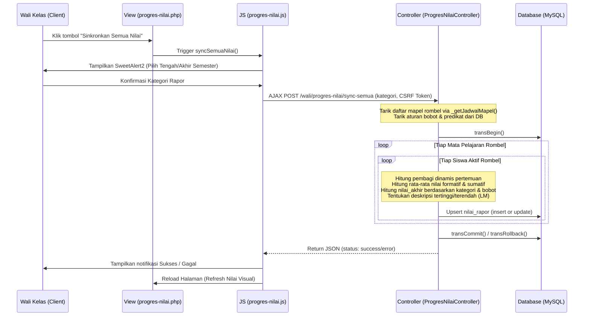

# Catatan Teknis Implementasi Sinkronisasi Nilai Massal (Wali Kelas)

Dokumen ini berisi catatan teknis mengenai penambahan fitur **Sinkronisasi Nilai Rapor Massal** pada Dashboard Wali Kelas di halaman Progres Nilai.

---

## 1. File yang Dimodifikasi & Ditambahkan

1. **Rute (Routes)**
   * **File:** [Routes.php](file:///d:/xampp/htdocs/erapoteasy/backend/app/Config/Routes.php)
   * **Modifikasi:** Menambahkan rute POST `/wali/progres-nilai/sync-semua` ke controller `ProgresNilaiController::syncSemuaMapel` di dalam grup rute `'wali'`.

2. **Controller Wali Kelas**
   * **File:** [ProgresNilaiController.php](file:///d:/xampp/htdocs/erapoteasy/backend/app/Controllers/WaliKelas/ProgresNilaiController.php)
   * **Modifikasi:**
     * Menambahkan method `syncSemuaMapel()` untuk memproses kalkulasi dan penyimpanan nilai rapor seluruh siswa dan mata pelajaran di rombel perwalian.
     * Mengekstrak pencarian mata pelajaran rombel (tiga lapis/fallback) ke dalam private method helper `_getJadwalMapel()`.
     * Merefaktorisasi `index()` untuk memanggil helper `_getJadwalMapel()`.
     * Menambahkan helper `_getPembagiDinamis()` untuk menghitung progress pertemuan/penilaian secara adil.

3. **View Dashboard Progres Nilai**
   * **File:** [progres-nilai.php](file:///d:/xampp/htdocs/erapoteasy/backend/app/Views/WaliKelas/progres-nilai.php)
   * **Modifikasi:**
     * Menambahkan tombol **"Sinkronkan Semua Nilai"** di header box filter dengan ikon refresh dan animasi transisi.
     * Menginjeksikan variabel global `csrfTokenName` dan `csrfTokenHash` dari PHP ke Javascript via objek global `window` agar AJAX POST bypass proteksi CSRF secara aman.

4. **JavaScript Client-Side**
   * **File:** [progres-nilai.js](file:///d:/xampp/htdocs/erapoteasy/backend/public/assets/js/WaliKelas/progres-nilai.js)
   * **Modifikasi:**
     * Menambahkan method global `window.syncSemuaNilai` yang memicu SweetAlert2 dialog.
     * Mengirimkan request AJAX POST ke `/wali/progres-nilai/sync-semua`.
     * Menampilkan loading state dan men-trigger reload halaman setelah sinkronisasi berhasil.

---

## 2. Struktur Alur Data & Cara Kerja

---

## 3. Optimasi Database & Integritas Data

* **Database Transaction:** Seluruh proses looping kalkulasi nilai untuk puluhan siswa dan belasan mata pelajaran dibungkus dalam satu transaksi database (`$db->transBegin()` & `$db->transCommit()`). Hal ini membuat penulisan ratusan data ke disk terjadi sekaligus dan aman. Jika ada satu mapel yang gagal, seluruh proses dibatalkan sehingga data tidak inkonsisten (*atomic operation*).
* **Bypass CSRF:** Request AJAX secara dinamis melampirkan CSRF Token yang valid dari CodeIgniter 4, menghindari error `403 Forbidden` saat mode proteksi CSRF diaktifkan di server produksi.
